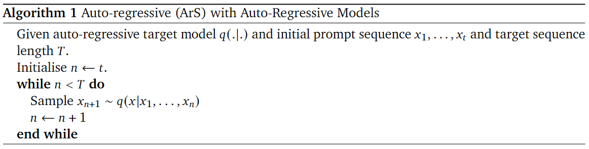
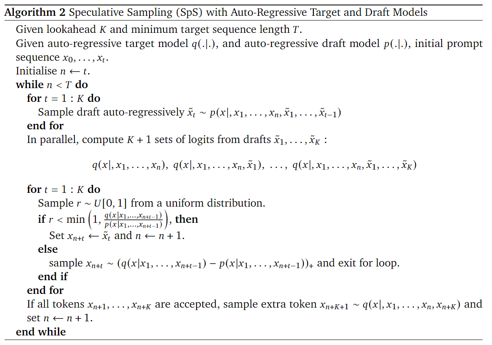
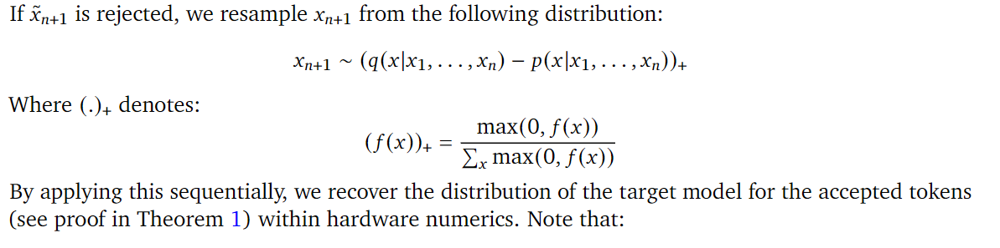
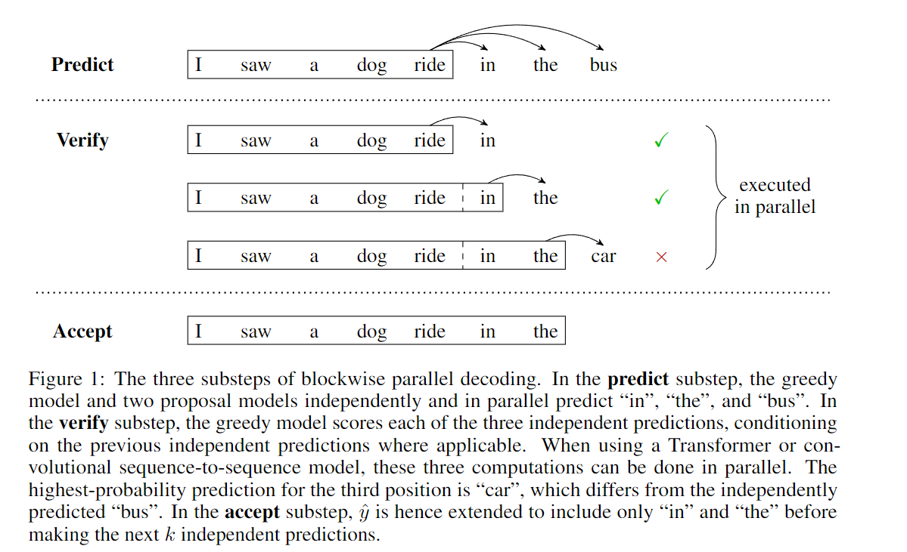

## Greedy decoding



Алгоритм greedy decoding работает следующим образом. На вход мы подаем
последовательность токенов, на выходе мы получаем распределение
вероятностей для следующего токена. Беря argmax, мы получаем новый
индекс и конкатенируем его с прошлыми, затем снова передаем в модель. Мы
прекращаем генерацию когда количество шагов достигнуто максимума или
номер индекса не будет равен токену конца строки(EOS).


Каждая модель имеет свой \"правильный\" набор токенов, при которых она
работает лучше всего. Если в сгенерированной последовательности токенов
поменять любой токен, тогда предсказания распределений наиболее
вероятных токенов ПОСЛЕ этого токена изменятся. С точки зрения argmax
данные токены могут и не поменяться, но с точки зрения того же topk
можно будет обнаружить разницу. Соответственно если долгое время
скармливать модели токены вне её изначального распределения,
\"корректность\" генерации относительно изначального greedy decoding
нарушится.


## Почему не работает speculative decoding (https://arxiv.org/pdf/2302.01318) 






Алгоритм speculative decoding строится вокруг того что мы можем при
помощи draft модели быстро сгенерировать токены, а затем в параллельном
режиме вычислить вероятности для этих токенов уже с точки зрения big
модели. А затем принять корректные, и выкинуть неправильные.

Ключевой вопрос КАК подобрать критерий валидности токенов от draft
модели. В данной статье используется следующий метод(я опущу детали
работы с параллельностью):

1.  Передаем условный токен START в draft модель, получаем распределение
    вероятностей для следующего токена, допустим токенов в словаре у нас
    всего 4, они дают такое распределение:

``` python
[0.8, 0.17, 0.03, 0.0]
```

Если мы возьмем argmax, от этого распределения получим индекс 0 (draft
модель предсказывает токен c индексом 0).

1.  Передаем тот же самый токен START в big модель, получаем
    распределение для следующего токена

``` python
[0.7, 0.2, 0.1, 0.0]
```

Если мы возьмем argmax, от этого распределения получим индекс 0 (big
модель предсказывает токен c индексом 0).

1.  big модель предсказывает \"правильный\" с ее точки зрения токен,
    данный токен также совпадает с токеном draft модели, казалось бы всё
    хорошо, но.

2.  На следующем шаге мы принимаем решение принять токен сгенерированный
    моделью или отвергнуть. Для этого производится выбор рандомного
    числа из равномерного распределения r \~ U\[0, 1\]. То есть в
    зависимости от random seed данное число может принять к примеру или
    0.1, или 0.9. Допустим нам выпало число r=0.9

3.  Критерий отвержения токена, это когда отношение вероятности
    следуюшего токена от big модели к вероятности от draft модели меньше
    чем число r.

4.  0.7/0.8=0.875, r=0.9 =\> мы отвергаем токен, который сгенерировала
    draft модель.

5.  Данную проблему должно решить пересемлирование. Оно состоит в том
    что мы должны вычесть из распределения big модели распределение
    draft модели.

``` python
[0.7, 0.2, 0.1, 0.0] - [0.8, 0.17, 0.03, 0.0] = [-0.1000,  0.0300,  0.0700,  0.0000]
```

1.  Следующий шаг - нормализация, зануляем отрицательные числа и делим
    все на сумму.

``` python
0.0300+0.0700=0.1
[0.0,  0.0300,  0.0700,  0.0] / 0.1 =  [0.0,  0.3,  0.7,  0.0]
```

1.  В итоге мы получаем что новый \"правильный токен\" находится под
    индексом 2, что отличается от вывода большой модели.

(алгоритм нарушает оригинальную последовательность)


``` python
import torch

tokenizer = ["Hello", "Dog", "Cat", "START"]

draft_dist = torch.tensor([0.8, 0.17, 0.03, 0.0])
draft_token = draft_dist.argmax(-1).item()

big_model_dist = torch.tensor([0.7, 0.2, 0.1, 0.0])
big_token = draft_dist.argmax(-1).item()
print(f"Correct next token = {tokenizer[big_token]}")

probs_ratio = torch.min(
    torch.ones(()), big_model_dist[draft_token] / draft_dist[draft_token]
)
print(f"probs_ratio={probs_ratio}")

# число может быть любое от 0.0 до 1.0
# но допустим в нашем случае нам выпало такое число
r = torch.tensor(0.9)

# если больше, значит отвергаем данный токен
if r > probs_ratio:
    print("Accept ", False)
    new_dist = big_model_dist - draft_dist
    print(f"new_dist={new_dist}")
    new_dist = torch.clamp((new_dist), min=0.0)
    print(f"new_dist={new_dist}")
    new_dist = new_dist / new_dist.sum()
    print(f"new_dist={new_dist}")

    print(f"Resampled next token = {tokenizer[new_dist.argmax(-1).item()]}")


# probs_ratio
```


``` text
Correct next token = Hello
probs_ratio=0.875
Accept  False
new_dist=tensor([-0.1000,  0.0300,  0.0700,  0.0000])
new_dist=tensor([0.0000, 0.0300, 0.0700, 0.0000])
new_dist=tensor([0.0000, 0.3000, 0.7000, 0.0000])
Resampled next token = Cat
```


## Доказательство работы без ошибок Blockwise Parallel Decoding (https://arxiv.org/pdf/1811.03115)





Работа данного алгоритма базируется на совпадении предсказанных токенов
от большой и малой модели.

Точно также как с greedy decoding, если подать модели одинаковые токены,
предсказания следующих для нее не изменятся.

Предположим что мы подаем токен START в big модель и получаем от нее
следующий токен 0, если мы далее подадим ей на вход последовательность
\[START, 0\], она выдаст нам распределение следующего токена и так
далее.

Если мы передадим токен START в draft модель, мы также получим
распределение вероятнстей следующего токена и получим индекс наиболее
вероятного.

Пусть первоначальные токены которые мы подаем в модели (START)
совпадают, распределения следующего токена могут отличаться, но *argmax*
должны совпадать. Если они совпадают, значит мы не поменяли
распределение у big модели и вероятности для следующего токена, будут
все равно что если бы сразу подали ей на вход \[START, 0\] и тд.

В случае первого же отличия токенов, мы берем argmax от big модели от
последнего совпавшего токена и конкатенируем принятые токены с прошлыми.
Иначе говоря стандартный greedy decoding.


``` python
import torch

tokenizer = ["Hello", "Dog", "Cat"]

draft_dist = torch.tensor(
    [
        [0.8, 0.17, 0.03],
        [0.5, 0.4, 0.1],
        [0.3, 0.5, 0.2],
        [0.17, 0.03, 0.8],
    ]
)
draft_tokens = draft_dist.argmax(-1)
print(f"draft_tokens={draft_tokens}")

big_model_dist = torch.tensor(
    [
        [0.7, 0.2, 0.1],
        [0.6, 0.2, 0.2],
        [0.5, 0.3, 0.2],
        [0.3, 0.5, 0.2],
    ]
)
big_model_tokens = big_model_dist.argmax(-1)
print(f"big_model_tokens={big_model_tokens}")
rejected_tokens = big_model_tokens != draft_tokens
print(rejected_tokens)
rejected_tokens = rejected_tokens.nonzero()

accepted_tokens = big_model_tokens
if rejected_tokens.shape[0] > 0:
    min_x = rejected_tokens[:,].min()
    accepted_tokens = big_model_tokens[: min_x + 1]

print("accepted_tokens=", accepted_tokens)
```


``` text
draft_tokens=tensor([0, 0, 1, 2])
big_model_tokens=tensor([0, 0, 0, 1])
tensor([False, False,  True,  True])
accepted_tokens= tensor([0, 0, 0])
```

В данном примере ошибка происходит на 3 токене, но так как прошлые 2
были корректными, значит мы можем взять следующий argmax в качестве
корректного.


### Пример работы алгоритма от deepmind

``` python
from transformers import (
    AutoModelForSeq2SeqLM,
    AutoTokenizer,
    T5ForConditionalGeneration,
)

model_big_hf = T5ForConditionalGeneration.from_pretrained(
    "ai-forever/sage-fredt5-large"
    # "models/reference"
)
assistant = T5ForConditionalGeneration.from_pretrained(
    "ai-forever/sage-fredt5-distilled-95m"
)
tokenizer = AutoTokenizer.from_pretrained("ai-forever/sage-fredt5-distilled-95m")

model_big_hf = model_big_hf.eval()
assistant = assistant.eval()

model_big_hf.to("cuda")
assistant.to("cuda")
None
```


``` python
import torch

device = "cuda"
inputs = tokenizer(["Усе задачи выполнены."], return_tensors="pt", padding=True).to(
    device
)


def get_probs(model: T5ForConditionalGeneration):
    with torch.no_grad():
        encoder_outputs = model.encoder(
            input_ids=inputs.input_ids,
            attention_mask=inputs.attention_mask,
            output_hidden_states=True,
        )
        hidden_states = encoder_outputs[0]

        decoder_ids = torch.tensor(
            [[0]],
            dtype=torch.long,
            device=device,
        )

        lm_logits = model.lm_head(
            model.decoder(
                input_ids=decoder_ids,
                encoder_hidden_states=hidden_states,
                use_cache=True,
                output_hidden_states=True,
            )[0]
        )
        lm_probs = torch.nn.functional.softmax(lm_logits, dim=-1)
        print(lm_probs[:, 0, lm_logits.argmax(-1).item()], lm_probs.argmax(-1))
        print(tokenizer.batch_decode(lm_probs.argmax(-1)))
        return lm_probs[:, 0, lm_logits.argmax(-1).item()]


big_probs = get_probs(model=model_big_hf)
draft_probs = get_probs(model=assistant)
probs_ratio = big_probs / draft_probs
print("probs_ratio", probs_ratio)
```


``` text
tensor([0.6861], device='cuda:0') tensor([[6039]], device='cuda:0')
['Все']
tensor([0.9648], device='cuda:0') tensor([[6039]], device='cuda:0')
['Все']
probs_ratio tensor([0.7112], device='cuda:0')
```


``` python
@torch.no_grad()
def one_step_gen_hf():
    device = "cuda"
    inputs = tokenizer(
        "Усе задачи выполнены.",
        return_tensors="pt",
        padding=True,
    ).to(device)
    input_ids = inputs.input_ids
    device = input_ids.device

    encoder_outputs_big = model_big_hf.encoder(
        input_ids=inputs.input_ids,
        attention_mask=inputs.attention_mask,
        output_hidden_states=True,
    )
    hidden_states_big = encoder_outputs_big[0]

    encoder_outputs_draft = assistant.encoder(
        input_ids=inputs.input_ids,
        attention_mask=inputs.attention_mask,
        output_hidden_states=True,
    )
    hidden_states_draft = encoder_outputs_draft[0]

    decoder_ids = torch.tensor(
        [[0]],
        dtype=torch.long,
        device=device,
    )

    # draft model

    draft_logits = assistant.lm_head(
        assistant.decoder(
            input_ids=decoder_ids,
            encoder_hidden_states=hidden_states_draft,
            use_cache=True,
            output_hidden_states=True,
        )[0]
    )

    draft_probs = torch.nn.functional.softmax(draft_logits, dim=-1)
    draft_token = draft_probs.argmax(-1)
    print("draft_logits=", draft_token)

    big_logits = model_big_hf.lm_head(
        model_big_hf.decoder(
            input_ids=torch.cat([decoder_ids], dim=-1),
            encoder_hidden_states=hidden_states_big,
            use_cache=True,
            output_hidden_states=True,
        )[0]
    )
    big_probs = torch.nn.functional.softmax(big_logits, dim=-1)
    big_tokens = big_probs.argmax(-1)
    print("big_tokens=", big_tokens)

    q = big_probs[:, 0, draft_token]
    p = draft_probs[:, 0, draft_token]

    tokens_ratio = torch.minimum(torch.ones(()), q / p)
    print("tokens_ratio=", tokens_ratio)
    r = torch.rand_like(tokens_ratio)
    print("r=", r)
    rejected_tokens = r > tokens_ratio
    print("rejected_tokens", rejected_tokens)
    next_token = draft_token
    print("q.item(), p.item()", q.item(), p.item())
    if rejected_tokens.item():
        resample = big_probs[:, 0] - draft_probs[:, 0]
        resample = torch.where(resample > 0, resample, 0.0)
        resample = resample / resample.sum()
        next_token = resample.argmax(-1).unsqueeze(0)

    decoder_ids = torch.cat([decoder_ids, next_token], dim=-1)
    return decoder_ids


for _ in range(30):
    result = one_step_gen_hf()
    print(tokenizer.batch_decode(result))
    print("===")
```


``` text
big_tokens= tensor([[6039]], device='cuda:0')
big_tokens= tensor([[6039]], device='cuda:0')
tokens_ratio= tensor([[[0.7112]]], device='cuda:0')
r= tensor([[[0.4092]]], device='cuda:0')
rejected_tokens tensor([[[False]]], device='cuda:0')
q.item(), p.item() 0.686094343662262 0.9647515416145325
['<pad>Все']
===
big_tokens= tensor([[6039]], device='cuda:0')
big_tokens= tensor([[6039]], device='cuda:0')
tokens_ratio= tensor([[[0.7112]]], device='cuda:0')
r= tensor([[[0.2760]]], device='cuda:0')
rejected_tokens tensor([[[False]]], device='cuda:0')
q.item(), p.item() 0.686094343662262 0.9647515416145325
['<pad>Все']
===
big_tokens= tensor([[6039]], device='cuda:0')
big_tokens= tensor([[6039]], device='cuda:0')
tokens_ratio= tensor([[[0.7112]]], device='cuda:0')
r= tensor([[[0.9845]]], device='cuda:0')
rejected_tokens tensor([[[False]]], device='cuda:0')
q.item(), p.item() 0.686094343662262 0.9647515416145325
['<pad>Все']
===
big_tokens= tensor([[6039]], device='cuda:0')
big_tokens= tensor([[6039]], device='cuda:0')
tokens_ratio= tensor([[[0.7112]]], device='cuda:0')
r= tensor([[[0.3197]]], device='cuda:0')
rejected_tokens tensor([[[False]]], device='cuda:0')
q.item(), p.item() 0.686094343662262 0.9647515416145325
['<pad>Все']
===
big_tokens= tensor([[6039]], device='cuda:0')
big_tokens= tensor([[6039]], device='cuda:0')
tokens_ratio= tensor([[[0.7112]]], device='cuda:0')
r= tensor([[[0.8409]]], device='cuda:0')
rejected_tokens tensor([[[True]]], device='cuda:0')
q.item(), p.item() 0.686094343662262 0.9647515416145325
['<pad>У']
===
big_tokens= tensor([[6039]], device='cuda:0')
big_tokens= tensor([[6039]], device='cuda:0')
tokens_ratio= tensor([[[0.7112]]], device='cuda:0')
r= tensor([[[0.6207]]], device='cuda:0')
rejected_tokens tensor([[[False]]], device='cuda:0')
q.item(), p.item() 0.686094343662262 0.9647515416145325
['<pad>Все']
===
big_tokens= tensor([[6039]], device='cuda:0')
big_tokens= tensor([[6039]], device='cuda:0')
tokens_ratio= tensor([[[0.7112]]], device='cuda:0')
r= tensor([[[0.8852]]], device='cuda:0')
rejected_tokens tensor([[[True]]], device='cuda:0')
q.item(), p.item() 0.686094343662262 0.9647515416145325
['<pad>У']
===
big_tokens= tensor([[6039]], device='cuda:0')
big_tokens= tensor([[6039]], device='cuda:0')
tokens_ratio= tensor([[[0.7112]]], device='cuda:0')
r= tensor([[[0.8955]]], device='cuda:0')
rejected_tokens tensor([[[True]]], device='cuda:0')
q.item(), p.item() 0.686094343662262 0.9647515416145325
['<pad>У']
===
big_tokens= tensor([[6039]], device='cuda:0')
big_tokens= tensor([[6039]], device='cuda:0')
tokens_ratio= tensor([[[0.7112]]], device='cuda:0')
r= tensor([[[0.6352]]], device='cuda:0')
rejected_tokens tensor([[[True]]], device='cuda:0')
q.item(), p.item() 0.686094343662262 0.9647515416145325
['<pad>У']
===
big_tokens= tensor([[6039]], device='cuda:0')
big_tokens= tensor([[6039]], device='cuda:0')
tokens_ratio= tensor([[[0.7112]]], device='cuda:0')
r= tensor([[[0.0754]]], device='cuda:0')
rejected_tokens tensor([[[True]]], device='cuda:0')
q.item(), p.item() 0.686094343662262 0.9647515416145325
['<pad>У']
===
big_tokens= tensor([[6039]], device='cuda:0')
big_tokens= tensor([[6039]], device='cuda:0')
tokens_ratio= tensor([[[0.7112]]], device='cuda:0')
r= tensor([[[0.8958]]], device='cuda:0')
rejected_tokens tensor([[[False]]], device='cuda:0')
q.item(), p.item() 0.686094343662262 0.9647515416145325
['<pad>Все']
===
big_tokens= tensor([[6039]], device='cuda:0')
big_tokens= tensor([[6039]], device='cuda:0')
tokens_ratio= tensor([[[0.7112]]], device='cuda:0')
r= tensor([[[0.2499]]], device='cuda:0')
rejected_tokens tensor([[[True]]], device='cuda:0')
q.item(), p.item() 0.686094343662262 0.9647515416145325
['<pad>У']
===
big_tokens= tensor([[6039]], device='cuda:0')
big_tokens= tensor([[6039]], device='cuda:0')
tokens_ratio= tensor([[[0.7112]]], device='cuda:0')
r= tensor([[[0.6059]]], device='cuda:0')
rejected_tokens tensor([[[True]]], device='cuda:0')
q.item(), p.item() 0.686094343662262 0.9647515416145325
['<pad>У']
===
big_tokens= tensor([[6039]], device='cuda:0')
big_tokens= tensor([[6039]], device='cuda:0')
tokens_ratio= tensor([[[0.7112]]], device='cuda:0')
r= tensor([[[0.7532]]], device='cuda:0')
rejected_tokens tensor([[[False]]], device='cuda:0')
q.item(), p.item() 0.686094343662262 0.9647515416145325
['<pad>Все']
===
big_tokens= tensor([[6039]], device='cuda:0')
big_tokens= tensor([[6039]], device='cuda:0')
tokens_ratio= tensor([[[0.7112]]], device='cuda:0')
r= tensor([[[0.2513]]], device='cuda:0')
rejected_tokens tensor([[[False]]], device='cuda:0')
q.item(), p.item() 0.686094343662262 0.9647515416145325
['<pad>Все']
===
big_tokens= tensor([[6039]], device='cuda:0')
big_tokens= tensor([[6039]], device='cuda:0')
tokens_ratio= tensor([[[0.7112]]], device='cuda:0')
r= tensor([[[0.8520]]], device='cuda:0')
rejected_tokens tensor([[[False]]], device='cuda:0')
q.item(), p.item() 0.686094343662262 0.9647515416145325
['<pad>Все']
===
big_tokens= tensor([[6039]], device='cuda:0')
big_tokens= tensor([[6039]], device='cuda:0')
tokens_ratio= tensor([[[0.7112]]], device='cuda:0')
r= tensor([[[0.4355]]], device='cuda:0')
rejected_tokens tensor([[[True]]], device='cuda:0')
q.item(), p.item() 0.686094343662262 0.9647515416145325
['<pad>У']
===
big_tokens= tensor([[6039]], device='cuda:0')
big_tokens= tensor([[6039]], device='cuda:0')
tokens_ratio= tensor([[[0.7112]]], device='cuda:0')
r= tensor([[[0.3966]]], device='cuda:0')
rejected_tokens tensor([[[True]]], device='cuda:0')
q.item(), p.item() 0.686094343662262 0.9647515416145325
['<pad>У']
===
big_tokens= tensor([[6039]], device='cuda:0')
big_tokens= tensor([[6039]], device='cuda:0')
tokens_ratio= tensor([[[0.7112]]], device='cuda:0')
r= tensor([[[0.7610]]], device='cuda:0')
rejected_tokens tensor([[[False]]], device='cuda:0')
q.item(), p.item() 0.686094343662262 0.9647515416145325
['<pad>Все']
===
big_tokens= tensor([[6039]], device='cuda:0')
big_tokens= tensor([[6039]], device='cuda:0')
tokens_ratio= tensor([[[0.7112]]], device='cuda:0')
r= tensor([[[0.2213]]], device='cuda:0')
rejected_tokens tensor([[[True]]], device='cuda:0')
q.item(), p.item() 0.686094343662262 0.9647515416145325
['<pad>У']
===
big_tokens= tensor([[6039]], device='cuda:0')
big_tokens= tensor([[6039]], device='cuda:0')
tokens_ratio= tensor([[[0.7112]]], device='cuda:0')
r= tensor([[[0.0924]]], device='cuda:0')
rejected_tokens tensor([[[True]]], device='cuda:0')
q.item(), p.item() 0.686094343662262 0.9647515416145325
['<pad>У']
===
big_tokens= tensor([[6039]], device='cuda:0')
big_tokens= tensor([[6039]], device='cuda:0')
tokens_ratio= tensor([[[0.7112]]], device='cuda:0')
r= tensor([[[0.2225]]], device='cuda:0')
rejected_tokens tensor([[[True]]], device='cuda:0')
q.item(), p.item() 0.686094343662262 0.9647515416145325
['<pad>У']
===
big_tokens= tensor([[6039]], device='cuda:0')
big_tokens= tensor([[6039]], device='cuda:0')
tokens_ratio= tensor([[[0.7112]]], device='cuda:0')
r= tensor([[[0.1793]]], device='cuda:0')
rejected_tokens tensor([[[False]]], device='cuda:0')
q.item(), p.item() 0.686094343662262 0.9647515416145325
['<pad>Все']
===
big_tokens= tensor([[6039]], device='cuda:0')
big_tokens= tensor([[6039]], device='cuda:0')
tokens_ratio= tensor([[[0.7112]]], device='cuda:0')
r= tensor([[[0.9977]]], device='cuda:0')
rejected_tokens tensor([[[False]]], device='cuda:0')
q.item(), p.item() 0.686094343662262 0.9647515416145325
['<pad>Все']
===
big_tokens= tensor([[6039]], device='cuda:0')
big_tokens= tensor([[6039]], device='cuda:0')
tokens_ratio= tensor([[[0.7112]]], device='cuda:0')
r= tensor([[[0.9327]]], device='cuda:0')
rejected_tokens tensor([[[False]]], device='cuda:0')
q.item(), p.item() 0.686094343662262 0.9647515416145325
['<pad>Все']
===
big_tokens= tensor([[6039]], device='cuda:0')
big_tokens= tensor([[6039]], device='cuda:0')
tokens_ratio= tensor([[[0.7112]]], device='cuda:0')
r= tensor([[[0.7980]]], device='cuda:0')
rejected_tokens tensor([[[True]]], device='cuda:0')
q.item(), p.item() 0.686094343662262 0.9647515416145325
['<pad>У']
===
big_tokens= tensor([[6039]], device='cuda:0')
big_tokens= tensor([[6039]], device='cuda:0')
tokens_ratio= tensor([[[0.7112]]], device='cuda:0')
r= tensor([[[0.6047]]], device='cuda:0')
rejected_tokens tensor([[[True]]], device='cuda:0')
q.item(), p.item() 0.686094343662262 0.9647515416145325
['<pad>У']
===
big_tokens= tensor([[6039]], device='cuda:0')
big_tokens= tensor([[6039]], device='cuda:0')
tokens_ratio= tensor([[[0.7112]]], device='cuda:0')
r= tensor([[[0.2811]]], device='cuda:0')
rejected_tokens tensor([[[False]]], device='cuda:0')
q.item(), p.item() 0.686094343662262 0.9647515416145325
['<pad>Все']
===
big_tokens= tensor([[6039]], device='cuda:0')
big_tokens= tensor([[6039]], device='cuda:0')
tokens_ratio= tensor([[[0.7112]]], device='cuda:0')
r= tensor([[[0.0136]]], device='cuda:0')
rejected_tokens tensor([[[False]]], device='cuda:0')
q.item(), p.item() 0.686094343662262 0.9647515416145325
['<pad>Все']
===
big_tokens= tensor([[6039]], device='cuda:0')
big_tokens= tensor([[6039]], device='cuda:0')
tokens_ratio= tensor([[[0.7112]]], device='cuda:0')
r= tensor([[[0.6154]]], device='cuda:0')
rejected_tokens tensor([[[True]]], device='cuda:0')
q.item(), p.item() 0.686094343662262 0.9647515416145325
['<pad>У']
===
```


## Пример того как это работает в huggingface


``` python
for _ in range(5):
    inputs = tokenizer(["Усе задачи выполнены."], return_tensors="pt", padding=True).to(
        "cuda"
    )
    # print(inputs)
    result = model_big_hf.generate(**inputs)
    print(tokenizer.batch_decode(result))
```


``` text
['<pad>Все задачи выполнены.</s>']
['<pad>Все задачи выполнены.</s>']
['<pad>Все задачи выполнены.</s>']
['<pad>Все задачи выполнены.</s>']
['<pad>Все задачи выполнены.</s>']
['<pad>Все задачи выполнены.</s>']
['<pad>Все задачи выполнены.</s>']
['<pad>Все задачи выполнены.</s>']
['<pad>Все задачи выполнены.</s>']
['<pad>Все задачи выполнены.</s>']
['<pad>Все задачи выполнены.</s>']
['<pad>Все задачи выполнены.</s>']
['<pad>Все задачи выполнены.</s>']
['<pad>Все задачи выполнены.</s>']
['<pad>Все задачи выполнены.</s>']
['<pad>Все задачи выполнены.</s>']
['<pad>Все задачи выполнены.</s>']
['<pad>Все задачи выполнены.</s>']
['<pad>Все задачи выполнены.</s>']
['<pad>Все задачи выполнены.</s>']
['<pad>Все задачи выполнены.</s>']
['<pad>Все задачи выполнены.</s>']
['<pad>Все задачи выполнены.</s>']
['<pad>Все задачи выполнены.</s>']
['<pad>Все задачи выполнены.</s>']
['<pad>Все задачи выполнены.</s>']
['<pad>Все задачи выполнены.</s>']
['<pad>Все задачи выполнены.</s>']
['<pad>Все задачи выполнены.</s>']
['<pad>Все задачи выполнены.</s>']
```


``` python
for _ in range(30):
    # for _ in range(1):

    inputs = tokenizer(["Усе задачи выполнены."], return_tensors="pt", padding=True).to(
        "cuda"
    )

    result = assistant.generate(**inputs)
    print(tokenizer.batch_decode(result))
```


``` text
['<pad>Все задачи выполнены.</s>']
['<pad>Все задачи выполнены.</s>']
['<pad>Все задачи выполнены.</s>']
['<pad>Все задачи выполнены.</s>']
['<pad>Все задачи выполнены.</s>']
['<pad>Все задачи выполнены.</s>']
['<pad>Все задачи выполнены.</s>']
['<pad>Все задачи выполнены.</s>']
['<pad>Все задачи выполнены.</s>']
['<pad>Все задачи выполнены.</s>']
['<pad>Все задачи выполнены.</s>']
['<pad>Все задачи выполнены.</s>']
['<pad>Все задачи выполнены.</s>']
['<pad>Все задачи выполнены.</s>']
['<pad>Все задачи выполнены.</s>']
['<pad>Все задачи выполнены.</s>']
['<pad>Все задачи выполнены.</s>']
['<pad>Все задачи выполнены.</s>']
['<pad>Все задачи выполнены.</s>']
['<pad>Все задачи выполнены.</s>']
['<pad>Все задачи выполнены.</s>']
['<pad>Все задачи выполнены.</s>']
['<pad>Все задачи выполнены.</s>']
['<pad>Все задачи выполнены.</s>']
['<pad>Все задачи выполнены.</s>']
['<pad>Все задачи выполнены.</s>']
['<pad>Все задачи выполнены.</s>']
['<pad>Все задачи выполнены.</s>']
['<pad>Все задачи выполнены.</s>']
['<pad>Все задачи выполнены.</s>']
```


``` python
for _ in range(30):
    inputs = tokenizer(["Усе задачи выполнены."], return_tensors="pt", padding=True).to(
        "cuda"
    )
    result = model_big_hf.generate(**inputs, assistant_model=assistant, do_sample=True)
    print(tokenizer.batch_decode(result))
```


``` text
['<pad>Все задачи выполнены.</s>']
['<pad>Усе задачи выполнены.</s>']
['<pad>Все задачи выполнены.</s>']
['<pad>Усе задачи выполнены.</s>']
['<pad>Все задачи выполнены.</s>']
['<pad>Все задачи выполнены.</s>']
['<pad>Усе задачи выполнены.</s>']
['<pad>Все задачи выполнены.</s>']
['<pad>Все задачи выполнены.</s>']
['<pad>Все задачи выполнены.</s>']
['<pad>Все задачи выполнены.</s>']
['<pad>Все задачи выполнены.</s>']
['<pad>Все задачи выполнены.</s>']
['<pad>Все задачи выполнены.</s>']
['<pad>Все задачи выполнены.</s>']
['<pad>Все задачи выполнены.</s>']
['<pad>У все задачи выполнены.</s>']
['<pad>Все задачи выполнены.</s>']
['<pad>Все задачи выполнены.</s>']
['<pad>Все задачи выполнены.</s>']
['<pad>Все задачи выполнены.</s>']
['<pad>Все задачи выполнены.</s>']
['<pad>Усе задачи выполнены.</s>']
['<pad>Все задачи выполнены.</s>']
['<pad>Усе задачи выполнены.</s>']
['<pad>Все задачи выполнены.</s>']
['<pad>Все задачи выполнены.</s>']
['<pad>Увсе задачи выполнены.</s>']
['<pad>Усе задачи выполнены.</s>']
['<pad>Усе задачи выполнены.</s>']
```


``` python
from transformers import GenerationConfig

for _ in range(10):

    inputs = tokenizer(["Усе задачи выполнены."], return_tensors="pt", padding=True).to(
        "cuda"
    )
    result = model_big_hf.generate(**inputs, assistant_model=assistant, do_sample=False)

    print(tokenizer.batch_decode(result))
```


``` text
['<pad>Все задачи выполнены.</s>']
['<pad>Все задачи выполнены.</s>']
['<pad>Все задачи выполнены.</s>']
['<pad>Все задачи выполнены.</s>']
['<pad>Все задачи выполнены.</s>']
['<pad>Все задачи выполнены.</s>']
['<pad>Все задачи выполнены.</s>']
['<pad>Все задачи выполнены.</s>']
['<pad>Все задачи выполнены.</s>']
['<pad>Все задачи выполнены.</s>']
```


## Имплементация алгоритма от google, для huggingface encoder-decoder архитекруры


``` python
from torch.nn.functional import scaled_dot_product_attention
from torch.nn.attention import SDPBackend, sdpa_kernel
from transformers.cache_utils import DynamicCache
import os


# copy from huggingface
def _crop_past_key_values(model, past_key_values, max_length):
    """Crops the past key values up to a certain maximum length."""
    new_past = []
    if model.config.is_encoder_decoder:
        for idx in range(len(past_key_values)):
            new_past.append(
                (
                    past_key_values[idx][0][:, :, :max_length, :],
                    past_key_values[idx][1][:, :, :max_length, :],
                    past_key_values[idx][2],
                    past_key_values[idx][3],
                )
            )
        past_key_values = tuple(new_past)
    # gptbigcode is special and stores kv in shape (batch_size, seq_len, dim), if it's a multi_query model
    elif "gptbigcode" in model.__class__.__name__.lower() or (
        model.config.architectures is not None
        and "gptbigcode" in model.config.architectures[0].lower()
    ):
        if model.config.multi_query:
            for idx in range(len(past_key_values)):
                past_key_values[idx] = past_key_values[idx][:, :max_length, :]
        else:
            for idx in range(len(past_key_values)):
                past_key_values[idx] = past_key_values[idx][:, :, :max_length, :]
    elif isinstance(past_key_values, DynamicCache):
        past_key_values.crop(max_length)
    elif past_key_values is not None:
        for idx in range(len(past_key_values)):
            if past_key_values[idx] != ([], []):
                new_past.append(
                    (
                        past_key_values[idx][0][:, :, :max_length, :],
                        past_key_values[idx][1][:, :, :max_length, :],
                    )
                )
            else:
                new_past.append((past_key_values[idx][0], past_key_values[idx][1]))
        past_key_values = tuple(new_past)
    return past_key_values


@torch.no_grad()
def generate_spec_hf(
    model: T5ForConditionalGeneration,
    draft: T5ForConditionalGeneration,
    max_batch_size: int,
    max_dec_seq_length: int,
    inputs: dict,
    speculate_k: int = 8,
) -> torch.Tensor:
    """
    Blockwise Parallel Decoding (https://arxiv.org/pdf/1811.03115)

    speculate_k: int = 8, - длина генерации маленькой модели
    """
    cur_batch_size = inputs.input_ids.size(0)
    device = inputs.input_ids.device

    finished_sequences = torch.full((max_batch_size, 1), False, device=device)
    finished_sequences_pos = torch.full((max_batch_size, 1), 0, device=device)

    # big model
    encoder_outputs_big = model.encoder(
        input_ids=inputs.input_ids,
        attention_mask=inputs.attention_mask,
        output_hidden_states=True,
    )
    # hidden_states_big = encoder_outputs_big[0]
    hidden_states_big = encoder_outputs_big

    encoder_outputs_draft = draft.encoder(
        input_ids=inputs.input_ids,
        attention_mask=inputs.attention_mask,
        output_hidden_states=True,
    )
    # hidden_states_draft = encoder_outputs_draft[0]
    hidden_states_draft = encoder_outputs_draft
    decoder_ids = torch.full(
        (max_batch_size, 1),
        model.config.decoder_start_token_id,
        dtype=torch.long,
        device=device,
    )
    decoder_ids_draft = decoder_ids.clone()

    if max_batch_size > cur_batch_size:
        finished_sequences[cur_batch_size:] = True
        decoder_ids[cur_batch_size:] = model.config.decoder_start_token_id

    global_step = 0

    past_key_values_big = None
    past_key_values_draft = None

    # начало алгоритма speculative decoding
    while global_step < max_dec_seq_length:
        decoder_outputs_draft = draft.generate(
            decoder_input_ids=decoder_ids,
            encoder_outputs=hidden_states_draft,
            use_cache=True,
            past_key_values=past_key_values_draft,
            attention_mask=inputs.attention_mask,
            return_dict_in_generate=True,
            max_new_tokens=speculate_k,
            do_sample=False,
        )

        past_key_values_draft = decoder_outputs_draft.past_key_values

        tokens_draft = decoder_outputs_draft.sequences
        decoder_ids_draft = tokens_draft[:, global_step:]

        decoder_outputs_big = model(
            decoder_input_ids=decoder_ids_draft,
            encoder_outputs=hidden_states_big,
            use_cache=True,
            past_key_values=past_key_values_big,
            attention_mask=inputs.attention_mask,
        )

        past_key_values_big = decoder_outputs_big.past_key_values
        big_logits = decoder_outputs_big.logits

        big_tokens = big_logits.argmax(-1)

        # находим места где последовательности завершились
        for pos, is_seq_finished in enumerate(finished_sequences):
            if not is_seq_finished.item():
                new_toks = (big_tokens[pos] == model.config.eos_token_id).nonzero()
                if new_toks.shape[0] != 0:
                    new_toks = new_toks.min()
                    finished_sequences_pos[pos] = decoder_ids.shape[1] + new_toks
                    finished_sequences[pos] = True
                    big_tokens[pos, new_toks + 1 :] = model.config.pad_token_id

        rejected_locations = big_tokens[:, :-1] != decoder_ids_draft[:, 1:]
        # принимаем в любом случае все завершенные ранее последовательности
        rejected_locations[finished_sequences.squeeze(1), :] = torch.tensor(
            False,
            device=finished_sequences.device,
        )

        rejected_locations = rejected_locations.nonzero()

        if rejected_locations.shape[0] == 0:
            new_tokens = big_tokens
        else:
            # принимаем решение как образать батч
            # находим первую ошибку среди всего батча
            min_rej_x = rejected_locations[:, 1:].min().item()
            new_tokens = big_tokens[:, : min_rej_x + 1].clone()

        # получаем итоговые токены
        decoder_ids = torch.cat([decoder_ids, new_tokens], dim=-1)

        if finished_sequences.all():
            break

        global_step = decoder_ids.shape[1] - 1
        past_key_values_big = _crop_past_key_values(
            model=model,
            past_key_values=past_key_values_big,
            max_length=global_step,
        )
        past_key_values_draft = _crop_past_key_values(
            model=draft,
            past_key_values=past_key_values_draft,
            # так как draft model ничего не знает о
            # новом засемплированном токене делаем -1
            max_length=global_step - 1,
        )

    for pos in range(max_batch_size):
        decoder_ids[pos, finished_sequences_pos[pos] + 1 :] = model.config.pad_token_id

    return decoder_ids


text_batch = [
    "Привет! Как дула?",
    "У нас идиальная диспциплина.",
    "Усе задачи выполнены.",
    "Думю ешцъа лет череа 10 ретроспективно просматривотьэ то будкетцц мне невероя тна ин те р но",
]


# for _ in range(30):
for _ in range(1):

    inputs = tokenizer(
        text_batch,
        return_tensors="pt",
        padding=True,
    ).to(device)

    outputs = generate_spec_hf(
        model=model_big_hf,
        draft=assistant,
        max_batch_size=len(text_batch),
        max_dec_seq_length=100,
        speculate_k=4,
        inputs=inputs,
    )

    # decoded_outputs = tokenizer.batch_decode(outputs, skip_special_tokens=False)
    decoded_outputs = tokenizer.batch_decode(outputs, skip_special_tokens=True)
    print(decoded_outputs)
```


``` text
['Привет! Как дела?', 'У нас идеальная дисциплина.', 'Все задачи выполнены.', 'Думаю, ещё лет через 10 ретроспективно просматривать это будетцца мне невероятно на ин те р но.']
```


### Compare Perfomance


``` python
import time

text_batch = [
    "Привет! Как дула?",
    "У нас идиальная диспциплина.",
    "Усе задачи выполнены.",
    "Думю ешцъа лет череа 10 ретроспективно просматривотьэ то будкетцц мне невероя тна ин те р но",
]
inputs = tokenizer(text_batch, return_tensors="pt", padding=True).to("cuda")
max_steps = 50
start = time.time()
for _ in range(max_steps):
    result = model_big_hf.generate(**inputs, do_sample=False)
greedy_time = time.time() - start

start = time.time()
for _ in range(max_steps):
    outputs = generate_spec_hf(
        model=model_big_hf,
        draft=assistant,
        max_batch_size=len(text_batch),
        max_dec_seq_length=100,
        speculate_k=6,
        inputs=inputs,
    )
spec_decoding_time = time.time() - start

print("Greedy decoding time=", greedy_time)
print("Speculative decoding time=", spec_decoding_time)
```


``` text
Greedy decoding time= 22.82227373123169
Speculative decoding time= 16.815321922302246
```


``` python
max_steps = 50
start = time.time()
for _ in range(max_steps):
    for text in text_batch:
        inputs = tokenizer(text, return_tensors="pt", padding=True).to("cuda")
        result = model_big_hf.generate(**inputs, do_sample=False)
greedy_time = time.time() - start

start = time.time()
for _ in range(max_steps):
    for text in text_batch:
        inputs = tokenizer(text, return_tensors="pt", padding=True).to("cuda")
        outputs = generate_spec_hf(
            model=model_big_hf,
            draft=assistant,
            max_batch_size=1,
            max_dec_seq_length=100,
            speculate_k=6,
            inputs=inputs,
        )
spec_decoding_time = time.time() - start

print("Greedy decoding time=", greedy_time)
print("Speculative decoding time=", spec_decoding_time)
```


``` text
Greedy decoding time= 39.67469120025635
Speculative decoding time= 26.551485061645508
```

Данный алгоритм можно ускорить если увеличить качество малой модели и
если групировать входные строки по длине, потому что одни могут быть
давно завершенными, хотя мы будем каждый раз прогонять их через
генерацию(во время батча больше 1). А также при помощи подбора наиболее
оптимального параметра speculate_k.


## Links


-   [Assisted Generation: a new direction toward low-latency text
    generation](https://huggingface.co/blog/assisted-generation#greedy-decoding-with-assisted-generation)
-   [Blockwise Parallel Decoding for Deep Autoregressive
    Models](https://arxiv.org/pdf/1811.03115)
-   [Accelerating Large Language Model Decoding with Speculative
    Sampling](https://arxiv.org/pdf/2302.01318)
-   [Speculative Decoding: When Two LLMs are Faster than
    One](https://youtu.be/S-8yr_RibJ4?si=Gh8YugAlRzSGE9HY)
-   [Source code of speculative decoding,
    huggingface](https://github.com/huggingface/transformers/blob/v4.45.1/src/transformers/generation/utils.py#L1992)
-   [Speculative decoding step by
    step](https://youtu.be/dQw4w9WgXcQ?si=zYLSORKxFQxcmOLd)

